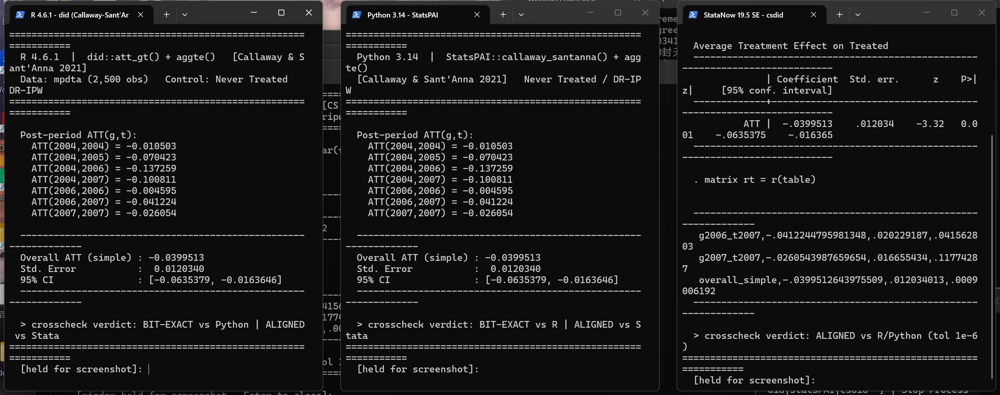

# EconCrosscheck

**One estimator, independent implementations, one verdict.**

EconCrosscheck is a cross-language validation engine for empirical research: run the *same* model in **R, Python, and Stata**, then diff the results automatically. If the numbers agree, your code is (almost certainly) right. If they don't, you stop interpreting — before a reviewer (or a referee report) stops you.

<p align="center">
  
</p>

*Live screenshot: Callaway & Sant'Anna (2021) staggered DiD on `mpdta`, run independently in R (`did`), Python (`StatsPAI`), and Stata (`csdid`). All three report Overall ATT = **-0.0399513**.*

## Why

AI agents write most of our econometrics code now. But an LLM that writes the wrong `vcov` in two languages — consistently — will hand you confident nonsense. The fix is older than LLMs: **independent implementations of the same estimator should agree**.

- R's `did` (Callaway et al.), Stata's `csdid` (Sant'Anna et al.), and Python ports are written by different teams. Same data + same model + same numbers = implementation is clean.
- One run, one number, no cross-check = you cannot tell a result from a bug.

This is the "double-entry bookkeeping" for regressions — inspired by a 2026 lecture series on AI agents for social-science research (where the speaker, priced out of Stata licenses, could only cross-check R vs Python), and by the [StatsPAI](https://github.com/brycewang-stanford/StatsPAI) parity index, which grades its own estimators against R/Stata references.

## Quick start

Zero dependencies — a single pure-stdlib Python file.

```
# 1. Run the same model in R / Python / Stata; each script writes a 4-column CSV:
#    term, estimate, se, pvalue
Rscript my_model.R            # -> r_results.csv
python  my_model.py           # -> py_results.csv
"C:\Program Files\Stata19\StataSE-64.exe" /e do my_model.do   # -> stata_results.csv

# 2. Diff them (first CSV is the reference):
python crosscheck.py r_results.csv py_results.csv stata_results.csv
```

Output:

```
term                    r_resultsvspy_resultsr_resultsvsstata_results
--------------------------------------------------------------------
g2004_t2004             bit-exact           aligned
...
overall_simple          bit-exact           aligned
--------------------------------------------------------------------
r_results vs py_results: bit-exact 8 | aligned 0 | FAIL 0
r_results vs stata_results: bit-exact 0 | aligned 8 | FAIL 0
RESULT: PASS (aligned) — exit code 0
```

## Verdicts

| Verdict | Meaning | Default tolerance |
|---|---|---|
| `bit-exact` | Machine-precision agreement | Δ ≤ 1e-10 |
| `aligned` | Agreement within tolerance | Δcoef ≤ 1e-6, ΔSE/SE ≤ 1e-4, Δp ≤ 1e-4 |
| `FAIL` | Significance flips or tolerance breached | — exit code 1 |

Exit codes make it gate-able: wire it into CI, a Makefile, or your SDD pipeline as a release gate.

## Example: Callaway & Sant'Anna (2021) replication

[`examples/cs2021_mpdta/`](examples/cs2021_mpdta/) replicates the canonical staggered-DiD application (minimum-wage effects on teen employment, 2,500 county-year obs) three ways:

| | Implementation | Authors' own package |
|---|---|---|
| R 4.6.1 | `did::att_gt()` + `aggte()` | Callaway & Sant'Anna |
| Python 3.14 | `StatsPAI.callaway_santanna()` | port with its own parity evidence |
| StataNow 19.5 | `csdid` + `csdid_estat simple` | Sant'Anna, Goodman-Bacon & Pedro |

Result: **R ↔ Python bit-exact on all 8 quantities** (7 post-period ATT(g,t) + overall); **R ↔ Stata aligned** (Δ ≈ 1e-7, different DR-IPW optimizers). Overall ATT = -0.0399 matches the published paper.

Run it yourself: each folder contains the three scripts, the shared dataset (`mpdta_data.csv` — one source of truth, all three languages read the same file), and the three result CSVs.

## What it does *not* do

- It cannot validate your **identification strategy** — two implementations of a wrong model agree perfectly. (The companion `REVIEWER_CHECKLIST.md` in the parent project covers clustering levels, staggered-DiD pitfalls, pre-trends, etc.)
- It is not a paper factory. Judgment stays with the researcher.

## Related work

- [StatsPAI](https://github.com/brycewang-stanford/StatsPAI) — agent-native Stata/R replacement with a queryable parity index (a superset of this idea, inside one library).
- Sakana AI-Scientist, Agent Laboratory — end-to-end "AI scientist" pipelines (the opposite bet: automation over verification).

## License

MIT
