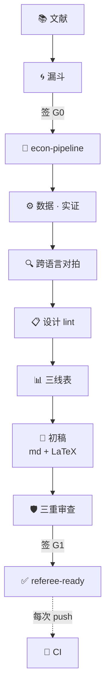

# EconWorkbench（中文版）

**从一个想法，到经得起审稿的论文——观点是你的，工程是机器的。**

[English](README.md) | 中文

[](https://github.com/ljftwq-dev/EconWorkbench/actions/workflows/ci.yml)
[](https://pypi.org/project/econworkbench/)

EconWorkbench 是一个面向实证研究全流程的开源工作台：文献、设计、估计、**验证**、成表。研究的判断权永远在你手里——工作台负责让每一步更快、让数字可信。



## 模块速览

| 模块 | CLI 命令 | 干什么 | 版本 |
|---|---|---|---|
| `crosscheck/` | `econ-crosscheck` | 把*同一个*模型在 **R / Python / Stata** 里各跑一遍，自动对比，一个结论：`bit-exact` / `aligned` / `FAIL` | v1.0 |
| `report/` | `econ-report` | 结果 CSV → 期刊级三线表（`.tex` / `.docx` / `.png`），一条命令 | v1.2 |
| `design/` | `econ-design` | 解读系数之前先给研究设计做 lint：聚类太少、交叠 DID 用 TWFE、预趋势 | v2.0 |
| `pipeline/` | `econ-pipeline` | spec2paper 编排器：卡片进、referee-ready 初稿出——两道人签名门控、失败停机、CI 模式 | v4.0 |

所有 CLI 都有 0/1 退出码——任何一个模块都可以直接接进 CI、Makefile 或 SDD 流水线当发布门用。

---

# 旅程：一篇论文从零到投稿

下面每一站都是真实的——实录来自一个进行中的项目（房价 × 社零，2011–2026）的真实终端输出，所有产物都能从 `examples/` 复现。

## 第 0 站 · 先读文献（[docs/literature.md](docs/literature.md)）

漏函问你"贡献是什么"之前，你得先知道街坊四邻。L0 协议：结构化检索 → **5 行文献卡** → Gap 定位图。

```
标题: Housing wealth and consumption
问题: 这篇在回答什么问题？
方法: 地区面板 TWFE + IV（供给冲击）
数据: CFPS 2010-2018，城市级房价
结论: 住房财富 MPC ≈ 0.05，财富通道成立
缝:   省内城市间变异从未被利用；没有 regime 断点
```

> 选题 = **Gap × 数据可得性 × 自己的比较优势**。每张卡的「缝」字段是 Gap 定位图的原材料——Gap 定位图直接喂给漏斗。

## 第 1 站 · 漏斗：从一句话到 spec 卡片（[docs/funnel.md](docs/funnel.md)）

漏斗是带牙齿的头脑风暴：**审稿人最终会问什么，漏斗就先问什么。** 四层——贡献 / 识别 / 数据可得性 / 稳健性预算。真实摘录：

> **作者**："我觉得房价对消费的影响是分层的。"
>
> **漏斗（L1）**："城市级数据能告诉我们什么省级面板看不到的？"
> **作者**："做一个稳健性对照，加强主论点。"
> **漏斗**："审稿人说'省级已经够了'——你怎么挡？"
> **作者**："省聚合是加权平均，传导若在城市层级，聚合引入衰减偏误压低系数——城市级是检验识别层级的必要条件。"
>
> **漏斗（L2）**："时间 FE 用哪个：(a) 季度 FE (b) 省×季度 FE？"
> **作者**："(b)——识别的才是省内变异，和论文的层级叙事严丝合缝。"

产出是一张填满的 **spec 卡片**（YAML，见 [`examples/pipeline_demo/spec_card模板.md`](examples/pipeline_demo/spec_card模板.md)）——含预注册的结果分支，杜绝事后圆场：

```yaml
honest_point_三分支: |
  ① 城市级显著为负 → 升级主结果
  ② 不显著但 |β|≥省级 → 「衰减偏误解释显著性缺失」
  ③ 方向翻转 → 层级叙事死穴（预先声明）
```

**卡片没填满，流水线不开工。** 卡片即合同。

## 第 2 站 · 签 G0，点火

```bash
pip install econworkbench[pipeline]
econ-pipeline my_paper_card.md
```

卡片没签名？driver 拒绝启动：

```
===== gate0 =====
[gate0] PAUSED: waiting for author signature on G0_放行 (topic sign-off)

[STOP] pipeline halted at gate0 (state saved; rerun to resume)
```

作者在卡片上签名（`G0_放行: 姓名 日期`），重跑同一命令——从这里到 G1 全是机器的活。

## 第 3 站 · 实证，然后对拍（v1.0）

你的代码跑一遍模型；**同一个模型换种语言再跑一遍**，结果自动 diff：

<p align="center">
  
</p>

*真实截图：Callaway & Sant'Anna (2021) 交叠 DID（mpdta 数据），在 R（`did`）、Python（`StatsPAI`）、Stata（`csdid`）中独立实现，三者 Overall ATT 均为 **-0.0399513**。*

这个习惯抓真 bug。本项目自己的结构断点引擎里，两套单独看都"对"的实现，放在一起吵得足够响，暴露了一个静默的 Python 回溯 bug 和一个 R `ts()` 日期标错——*在任何数字进初稿之前*（[examples/bai_perron_breakpoints](examples/bai_perron_breakpoints/)）：

```
term            RSS_py           RSS_R      |dRSS|  breaks                grade
k=2             18.284462        18.284462   2.13e-14  2020-04;2023-09    bit-exact
RESULT: PASS (bit-exact)   （可比的 k 上最大 |ΔRSS| = 4.3e-14）
```

## 第 4 站 · 设计 lint（v2.0）

解读任何系数之前，`econ-design` 先审研究设计：

```
EconWorkbench design lint | clusters: 70 | timing: unknown
[  OK] CLUSTER  n_clusters=70 >= 50 — asymptotic CRVE acceptable
RESULT: CLEAN
```

三条确定性规则，每条带修复动作和引文：`CLUSTER`（<30 FLAG / 30–49 WARN → wild cluster bootstrap）、`STAGGER`（交叠 DID 用 TWFE → Callaway-Sant'Anna / Sun-Abraham）、`PRETREND`（前期漂移 → 联合检验 + Rambachan & Roth 敏感性）。

## 第 5 站 · 期刊级三线表（v1.2）

通过对拍的同一批 CSV，一条命令出表：

```bash
econ-report r_results.csv py_results.csv --title "表1" --out table1
# -> table1.tex（booktabs）+ table1.docx（Word 三线表）+ table1.png
```

<p align="center">
  
</p>

## 第 6 站 · 双模板初稿：Markdown + LaTeX

draft 步骤同时产出两份骨架：Markdown 用来和 AI 助手填内容，LaTeX 用来投稿（Top 5 全收 LaTeX，AER 官方就有模板）：

```
[draft] markdown skeleton -> draft/初稿骨架.md
[draft] LaTeX skeleton -> draft/初稿骨架.tex (Overleaf 可编译；\input 嵌入主表)
```

```latex
\section{识别策略}
% GLM_FILL: 识别方程示例，如 TWFE：
\begin{equation}
  y_{it} = \beta \, \mathrm{hp}_{it} + \alpha_i + \lambda_{prov \times t} + \gamma' X_{it} + \varepsilon_{it}
\end{equation}
...
\input{table1}   % 自动生成的三线表，直接嵌入
```

## 第 7 站 · 三重审查（没过审的东西到不了 G1）

**数据审查** —— `data/` 里每份 CSV 体检；已知原始宽表可在卡片显式豁免：

```
house_price_70cities.csv   EXEMPT (card-declared, hand-verified)
panel_final.csv            1740 rows x 7 cols
[data_audit] OK: 13 CSVs pass (1 exempt)
```

**数字审查（statcheck 式）** —— 初稿里每个数字必须溯源到 `results/`：要么是原值，**要么能重算出来**（est/se → t，正态近似 → p）。编造的数字当场停机。测试时真实发生过：

```
测试稿写着："系数 -0.103（t = 1.1, p 实为 0.27）；另有个编造的 t = 9.99"
[number_check] FAIL: 1 number(s) not traceable — halting:
      orphans: 9.99
```

（-0.103 溯源到 CSV；t=1.1 和 p=0.27 由 est/se **重算**放行；9.99 哪儿都找不到 → 停机。`p < .05` 这类阈值表述自动豁免。）

**格式审查** —— 成稿 docx 检查字体统一、Heading 样式、表格存在；只审文件名含 `成稿`/`final` 的文件，不打扰中间稿。

## 第 8 站 · 签 G1——然后永远保持绿

作者签 `G1_放行`，流水线交付。再把 [`examples/pipeline_demo/ci-driver.yml`](examples/pipeline_demo/ci-driver.yml) 放进论文 repo：此后每次 `git push`，GitHub Actions 自动重跑全链——等签名的门控算绿，任何真失败亮红。你的论文从此是一个**每次 push 都自证清白的仓库**（showyourwork 式持续验证）。

---

## 为什么需要它

现在的计量代码大部分是 AI 写的。但如果一个大模型在两种语言里**一致地**写错了 `vcov`——它会给你一个自信的、但错误的结果。解法比大模型古老得多：**同一估计量的独立实现应当一致。**

- R 的 `did`（Callaway 团队）、Stata 的 `csdid`（Sant'Anna 团队）、Python 的移植版，是三拨人各自写的。同一份数据 + 同一个模型 + 同样的数字 = 实现是干净的。
- 只跑一遍、只看一个数字 = 你无法区分"结果"和"bug"。

这相当于回归分析里的**复式记账法**——灵感来自 2026 年一个"AI 智能体赋能社科研究"系列讲座和 [StatsPAI](https://github.com/brycewang-stanford/StatsPAI) 的 parity index。数字审查承自 [statcheck](https://github.com/MicheleNuijten/statcheck)（"统计量的拼写检查器"）；CI 姿态承自 [showyourwork](https://github.com/showyourwork/showyourwork)。

## 判定等级

| 判定 | 含义 | 默认容差 |
|---|---|---|
| `bit-exact` | 机器精度级一致 | Δ ≤ 1e-10 |
| `aligned` | 容差内一致 | Δ系数 ≤ 1e-6，ΔSE/SE ≤ 1e-4，Δp ≤ 1e-4 |
| `FAIL` | 显著性翻转或超出容差 | — 退出码 1 |

## 示例

- [`examples/cs2021_mpdta/`](examples/cs2021_mpdta/) —— Callaway & Sant'Anna (2021) 三语言复现：R↔Python 全部 8 个量 bit-exact，R↔Stata aligned（Δ≈1e-7），overall ATT 与原论文一致。
- [`examples/bai_perron_breakpoints/`](examples/bai_perron_breakpoints/) —— 手写精确 DP vs `strucchange`：对拍本身抓出两个真 bug 后 PASS (bit-exact)。
- [`examples/design_demo/`](examples/design_demo/) —— 坏研究踩中全部三条 lint 规则；好研究返回 CLEAN。
- [`examples/pipeline_demo/`](examples/pipeline_demo/) —— 可跑的流水线卡片 + CI 模板。真实运行全程实录：[docs/showcase.md](docs/showcase.md)。

## 它*不*做什么

- 它验证不了你的**识别策略**——错误模型的两个实现会完美一致。`design/` 只 lint 审稿人 checklist 常见项，识别判断权在你。
- 它不是论文工厂。漏斗只提问，门控只认人的签名。批量灌水、自动投稿明确排除在外。

## 相关工作

- [StatsPAI](https://github.com/brycewang-stanford/StatsPAI) —— agent 原生的 Stata/R 替代品，带可查询的 parity index。
- [statcheck](https://github.com/MicheleNuijten/statcheck) —— 统计量的拼写检查器；我们的数字审查是它的后代。
- [showyourwork](https://github.com/showyourwork/showyourwork) —— 可复现论文工作流；我们的 CI 姿态是它的后代。
- Sakana AI-Scientist、Agent Laboratory —— 端到端"AI 科学家"流水线（相反的押注：自动化优先于验证）。

## 许可

MIT
